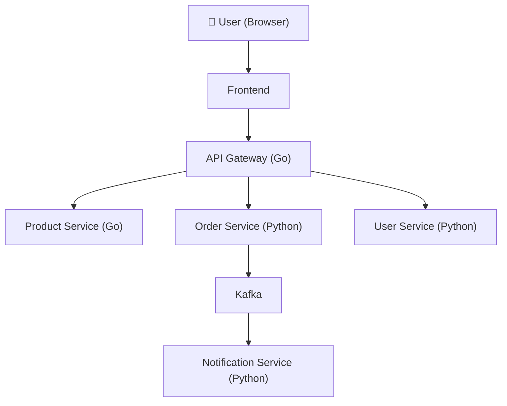
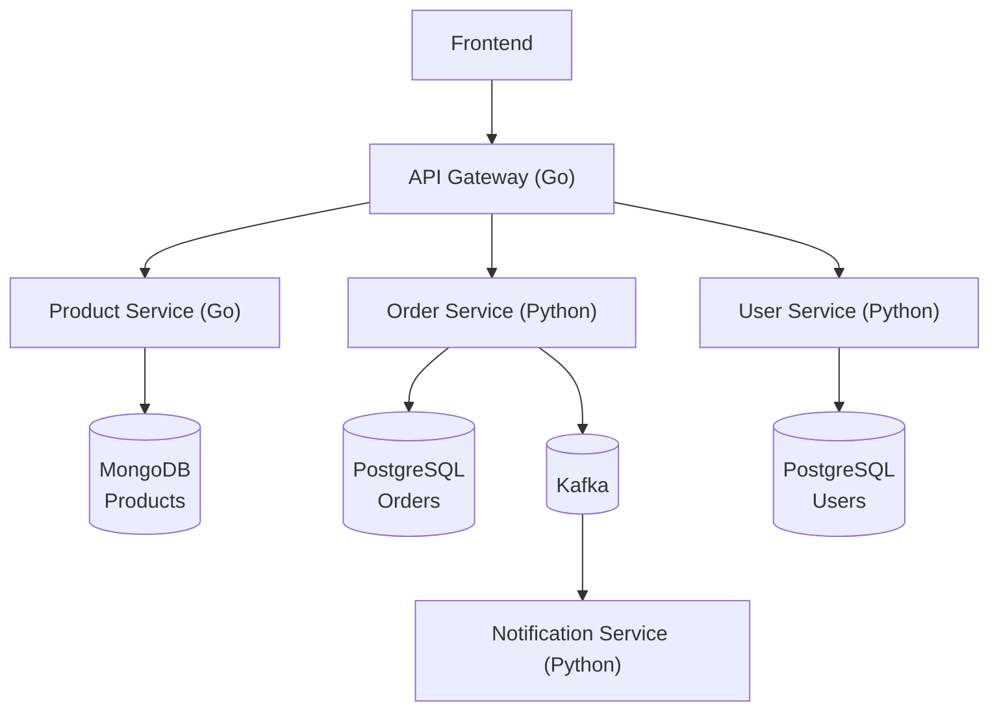
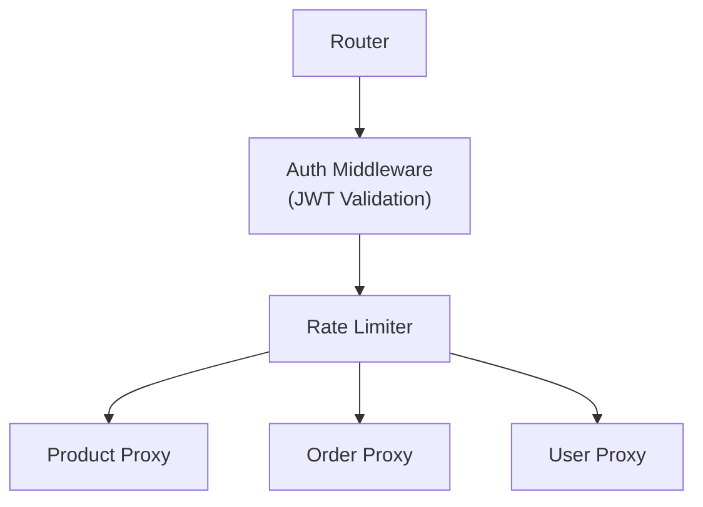
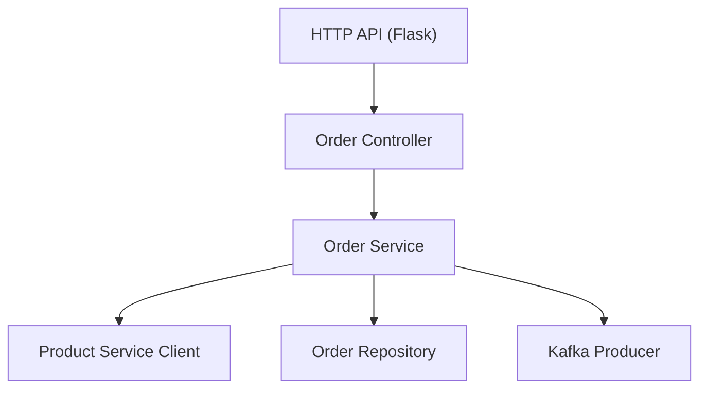
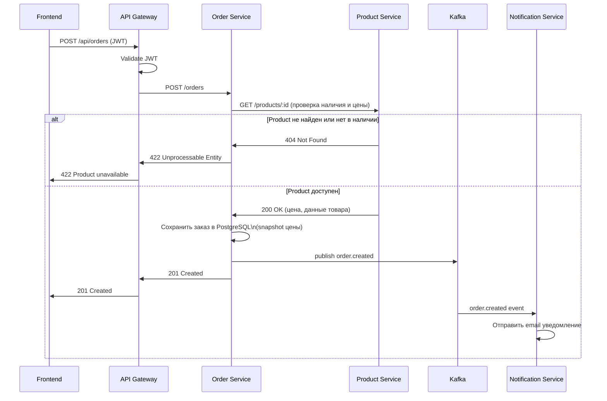

# TechShop Microservices Architecture

## 1. Overview

TechShop — это e-commerce система, реализованная на основе микросервисной архитектуры.  
Система разделена на несколько независимых сервисов, каждый из которых отвечает за отдельный бизнес-контекст.

Основные цели архитектуры:

- изоляция доменных областей
- независимое масштабирование сервисов
- независимые базы данных
- асинхронная интеграция через события
- единая точка входа через API Gateway

Основные технологии:

| Component | Technology |
|-----------|------------|
| API Gateway | Go |
| Product Service | Go |
| Order Service | Python |
| User Service | Python |
| Notification Service | Python |
| Messaging | Kafka |
| Databases | MongoDB, PostgreSQL |

---

## 2. Services Decomposition

Монолитное приложение было декомпозировано на 5 микросервисов на основе принципов **Domain-Driven Design**.

Критерии разделения:

- независимые бизнес-контексты
- отдельная бизнес-логика
- отдельное хранилище данных
- минимальные зависимости между сервисами

---

### 2.1 API Gateway

**Responsibility**

API Gateway является **единственной точкой входа** для клиентов.

Основные функции:

- маршрутизация запросов к нужному сервису
- проверка JWT (централизованная аутентификация)
- rate limiting (защита от перегрузки)
- централизованная обработка ошибок
- логирование всех входящих запросов

**Почему выделен отдельно**

- единая точка авторизации — JWT проверяется один раз, не в каждом сервисе
- сервисы могут менять адреса — frontend об этом не знает
- упрощение клиентского кода
- возможность менять внутреннюю архитектуру без изменения внешнего API

**Bounded Context**

Gateway **не содержит бизнес-логики** и **не хранит данные**.  
Он выполняет только инфраструктурные функции: authentication, routing, throttling.

---

### 2.2 Product Service

**Responsibility**

Отвечает за каталог товаров.

**Основные функции**

- управление товарами и категориями
- хранение цен
- поиск и фильтрация товаров

**Bounded Context**

Product Service владеет: `product`, `category`, `price`

Он **не знает** о заказах и пользователях.

**Database**

MongoDB — потому что:

- гибкая схема (у товаров могут быть разные атрибуты)
- удобно хранить каталоги с вложенными структурами
- горизонтальное масштабирование

---

### 2.3 Order Service

**Responsibility**

Управляет заказами пользователей.

**Основные функции**

- создание заказа (с предварительной проверкой товара в Product Service)
- изменение статуса заказа
- хранение позиций заказа
- публикация событий в Kafka

**Bounded Context**

Order Service владеет: `orders`, `order_items`, `order_status`

Order Service **не хранит данные пользователя** — только `user_id`.  
Order Service **не хранит данные товара** — при создании заказа запрашивает цену у Product Service и сохраняет её в `order_items` (snapshot цены на момент заказа).

**Database**

PostgreSQL — потому что:

- транзакционность (ACID) критична для финансовых операций
- строгая схема
- удобство работы с отношениями (order → order_items)

---

### 2.4 User Service

**Responsibility**

Управляет учетными записями пользователей.

**Основные функции**

- регистрация пользователей
- авторизация (login)
- хранение паролей (bcrypt)
- генерация и обновление JWT

**Bounded Context**

User Service владеет: `users`, `credentials`, `authentication`

**Database**

PostgreSQL — потому что:

- строгая схема
- безопасность и транзакции
- простота поддержки

---

### 2.5 Notification Service

**Responsibility**

Отправка уведомлений на основе событий.

**Основные функции**

- подписка на Kafka topics
- отправка email уведомлений

**Bounded Context**

Notification Service **не владеет данными**.  
Он только читает события из Kafka и выполняет side effects (отправка email).

---

## 3. Communication Patterns

В системе используются **два типа коммуникации**.

### REST (Synchronous)

Используется когда нужен немедленный ответ.

Примеры:
- `GET /products` — получить каталог
- `POST /auth/login` — получить JWT
- `POST /orders` — создать заказ

Плюсы: простота, предсказуемость  
Минусы: сильная связность сервисов

### Kafka (Asynchronous)

Используется когда не требуется мгновенный ответ и нужно уведомить другие сервисы.

Примеры:
- `order.created` — заказ создан
- `order.updated` — статус изменён
- `user.registered` — новый пользователь

Плюсы: слабая связность, масштабируемость, event-driven architecture

---

## 4. Data Ownership

Используется паттерн **Database per Service**.

Каждый сервис владеет своей базой данных. Прямой доступ к БД другого сервиса **запрещён**.

| Service | Database | Data |
|--------|----------|------|
| Product Service | MongoDB | Products, categories, prices |
| Order Service | PostgreSQL | Orders, order_items (с snapshot цены) |
| User Service | PostgreSQL | Users, credentials |
| Notification Service | — | Нет хранилища |
| API Gateway | — | Нет хранилища |

Это обеспечивает:
- изоляцию данных
- независимую эволюцию схем
- отказоустойчивость

---

## 5. Diagrams

### Context Diagram



---

### Container Diagram



---

### Component Diagram — API Gateway



---

### Component Diagram — Order Service



---

### Sequence Diagram — Create Order



---

## 6. Kafka Topics & Message Schemas

### `order.created`
```json
{
  "order_id": "uuid",
  "user_id": "uuid",
  "items": [
    {
      "product_id": "string",
      "quantity": "integer",
      "price_snapshot": "float"
    }
  ],
  "total_amount": "float",
  "status": "pending",
  "timestamp": "ISO 8601"
}
```

### `order.updated`
```json
{
  "order_id": "uuid",
  "user_id": "uuid",
  "status": "confirmed | shipped | delivered",
  "updated_at": "ISO 8601"
}
```

### `order.cancelled`
```json
{
  "order_id": "uuid",
  "user_id": "uuid",
  "reason": "string",
  "cancelled_at": "ISO 8601"
}
```

### `user.registered`
```json
{
  "user_id": "uuid",
  "email": "string",
  "registered_at": "ISO 8601"
}
```